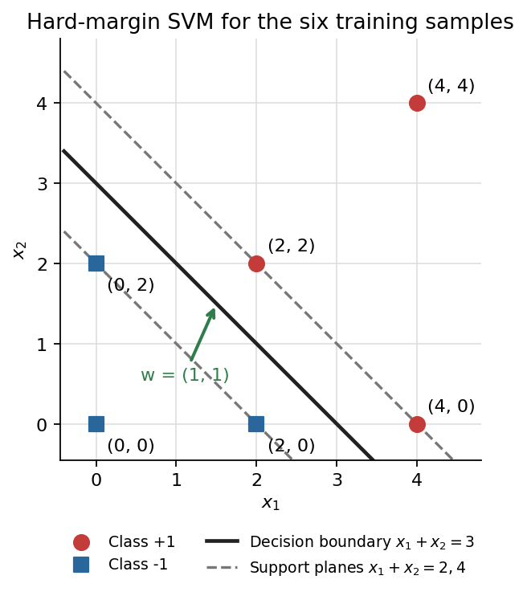
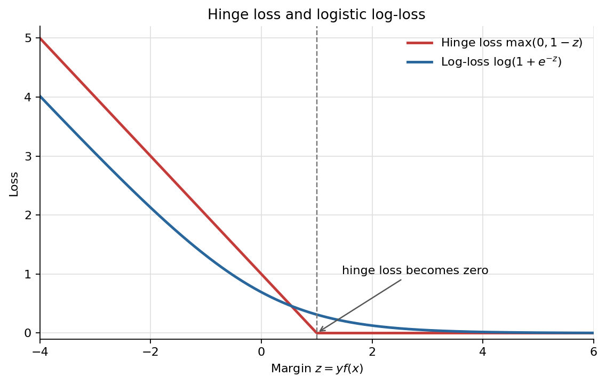

姓名：徐诗霖
学号：202622080929

## 1 硬间隔支持向量机

训练样本为：

- 正类 $+1$：$(2,2),(4,4),(4,0)$
- 负类 $-1$：$(0,0),(2,0),(0,2)$

### 1(a) 最优分类面、权向量和间隔

负类凸包靠近正类的一条边是

$$
x_1+x_2=2,
$$

正类凸包靠近负类的一条边是

$$
x_1+x_2=4.
$$

两条边平行，因此最大间隔分类面位于二者正中间：

$$
\boxed{x_1+x_2-3=0}.
$$

写成 $w_1x_1+w_2x_2+b=0$，可取

$$
\boxed{w=(1,1)^T,\qquad b=-3}.
$$

权向量 $w$ 垂直于分类面，并指向函数值增大的正类一侧。(图表见下页)

分类面到任一最近样本点的距离为

$$
\operatorname{margin}
=\frac{|x_1+x_2-3|}{\sqrt{1^2+1^2}}
=\boxed{\frac{1}{\sqrt 2}}.
$$

题目将 margin 定义为“分类面到最近点的距离”，所以答案是 $$1/\sqrt2$$。若把两侧支持超平面之间的总宽度称为间隔，则总宽度为

$$
\frac{2}{\|w\|}=\sqrt2.
$$

### 1(b) 支持向量

在规范化参数 $$w=(1,1)^T,b=-3$$ 下，支持向量满足

$$
y_i(w^Tx_i+b)=1.
$$

逐点计算可得：

- 正类 $(2,2)$：$$w^Tx+b=1$$
- 正类 $(4,0)$：$$w^Tx+b=1$$
- 负类 $(2,0)$：$w^Tx+b=-1$，乘以 $y=-1$ 后为 $1$
- 负类 $(0,2)$：同理为 $1$

因此支持向量为

$$
\boxed{(2,2),(4,0),(2,0),(0,2)}.
$$

它们恰好落在两条支持超平面 $x_1+x_2=4$ 和 $x_1+x_2=2$ 上，是离决策面最近的训练点；移动这些点可能改变最优分类面。其余两点的函数间隔严格大于 1，不是支持向量。

## 2 核技巧为什么不会因高维特征空间而显著增加运行时间

SVM 的对偶问题为

$$
\max_{\alpha}\quad
\sum_{i=1}^{n}\alpha_i-
\frac12\sum_{i=1}^{n}\sum_{j=1}^{n}
\alpha_i\alpha_jy_iy_j\,x_i^Tx_j,
$$

约束为

$$
\alpha_i\ge 0,\qquad \sum_{i=1}^{n}\alpha_i y_i=0.
$$

把输入映射到高维空间 $\phi(x)$ 后，算法只需要使用特征向量的内积

$$
\phi(x_i)^T\phi(x_j).
$$

核函数直接计算这个内积：

$$
K(x_i,x_j)=\phi(x_i)^T\phi(x_j),
$$

因此不必显式构造可能非常高维甚至无限维的 $\phi(x)$。预测函数也可写为

$$
f(x)=\sum_{i\in SV}\alpha_i y_iK(x_i,x)+b,
$$

只需要对支持向量计算核函数。这就是核技巧能够在高维特征空间训练非线性 SVM，而计算量通常不会随显式特征维数急剧增长的原因。

需要注意，“不显著增加”并不表示核 SVM 对大样本总是便宜：训练通常需要构造或访问 $n\times n$ 核矩阵，时间和内存开销会随样本数 $n$$ 增大；预测开销也与支持向量数量有关。

## 3 凸优化中的等式约束与不等式约束优化

### 3.1 等式约束优化

考虑

$$
\min_x f(x),\qquad \text{s.t. }h_i(x)=0,\ i=1,\ldots,m.
$$

构造拉格朗日函数

$$
L(x,\lambda)=f(x)+\sum_{i=1}^{m}\lambda_i h_i(x).
$$

一阶必要条件是

$$
\nabla_xL(x,\lambda)=0,\qquad h_i(x)=0.
$$

求解这些方程可以得到候选最优点。若问题为凸问题、目标函数凸且等式约束为仿射函数，则满足上述条件的可行点是全局最优解。数值计算中常用消元法、拉格朗日乘子法、等式约束牛顿法等。

### 3.2 不等式约束优化

考虑

$$
\min_x f(x),\qquad
\text{s.t. }g_i(x)\le0,\quad h_j(x)=0.
$$

拉格朗日函数为

$$
L(x,\lambda,\nu)
=f(x)+\sum_i\lambda_i g_i(x)+\sum_j\nu_jh_j(x),
$$

其中不等式约束乘子必须满足 $$\lambda_i\ge0$$。最优点通常由 KKT 条件刻画：

1. 原始可行性：$g_i(x^*)\le0,\ h_j(x^*)=0$；
2. 对偶可行性：$\lambda_i^*\ge0$；
3. 驻点条件：$\nabla_xL(x^*,\lambda^*,\nu^*)=0$；
4. 互补松弛：$\lambda_i^*g_i(x^*)=0$。

互补松弛说明：若某约束在最优点不活跃，即 $g_i(x^*)<0$，则对应乘子为 0；若乘子大于 0，则该约束必定取等号。在凸问题并满足适当约束资格条件（如 Slater 条件）时，KKT 条件也是充分条件。常用算法包括活跃集法、障碍函数法和原始—对偶内点法。

## 4 支持向量机的风险、损失函数及与逻辑回归的比较

### 4.1 SVM 目标函数

令 $f(x)=w^Tx+b$。软间隔 SVM 可写为

$$
\boxed{
\min_{w,b}\ 
\underbrace{\frac12\|w\|_2^2}_{\text{结构风险}}
+
\underbrace{C\sum_{i=1}^{n}
\max\left(0,1-y_i f(x_i)\right)}_{\text{经验风险}}
}.
$$

- **结构风险** $\frac12\|w\|^2$：限制模型复杂度。减小 $$\|w\|$$ 等价于增大几何间隔，有利于提高泛化能力。
- **经验风险**：惩罚训练样本的间隔违例和误分类，使模型拟合训练数据。
- **参数 $C$**：调节二者的权衡。$C$ 越大，越重视训练误差；$C$ 越小，越强调大间隔和正则化。

也可用平均损失形式写成 $\frac{\lambda}{2}\|w\|^2+\frac1n\sum_i\ell_i$，两种写法本质相同，只是参数尺度不同。

### 4.2 铰链损失与对数损失

令分类间隔 $z=yf(x)$。

铰链损失为

$$
\boxed{\ell_{\text{hinge}}(z)=\max(0,1-z)}.
$$

逻辑回归的对数损失为

$$
\boxed{\ell_{\log}(z)=\log(1+e^{-z})}.
$$

两者都随分类间隔 $z$ 增大而减小，但铰链损失在 $$z\ge1$$ 后等于 0；对数损失则平滑下降，只在 $z\to+\infty$ 时趋近 0。

### 4.3 远离决策面的正确分类样本为何影响不同

若一个样本被正确分类且满足 $z=yf(x)>1$，则

$$
\ell_{\text{hinge}}(z)=0,
\qquad
\frac{\partial \ell_{\text{hinge}}}{\partial z}=0.
$$

因此它不是支持向量，对 SVM 目标函数关于决策面参数的梯度贡献为 0，不会改变最优决策面。

对逻辑回归，

$$
\frac{\partial \ell_{\log}}{\partial z}
=-\frac{1}{1+e^z}.
$$

对于任何有限的 $z$，该导数都不严格等于 0。因此远离决策面的正确分类点仍有一个很小但非零的梯度贡献，原则上仍会影响逻辑回归的参数和决策面；只是当 $z$ 很大时，这种影响会非常小。

## 5 EM 算法与混合高斯模型

### 5.1 EM 算法的一般流程

设观测变量为 $X$，隐变量为 $Z$，参数为 $\theta$。EM 算法反复执行：

1. 初始化参数 $\theta^{(0)}$；
2. **E 步**：在当前参数下计算隐变量的后验分布，并构造完整数据对数似然的条件期望

   $$
   Q(\theta,\theta^{(t)})
   =\mathbb E_{Z\mid X,\theta^{(t)}}
   [\log p(X,Z\mid\theta)];
   $$

3. **M 步**：最大化该期望

   $$
   \theta^{(t+1)}
   =\arg\max_\theta Q(\theta,\theta^{(t)});
   $$

4. 若对数似然增量或参数变化小于阈值则停止，否则返回 E 步。

EM 每轮不会降低观测数据对数似然，但一般只能保证收敛到局部最优点或鞍点，因此初始化很重要。

### 5.2 GMM 的完整数据对数似然

对含 $K$ 个分量的 GMM，设

$$
p(x_n\mid\theta)=\sum_{k=1}^{K}\pi_k
\mathcal N(x_n\mid\mu_k,\Sigma_k),
\qquad
\sum_{k=1}^{K}\pi_k=1.
$$

引入 one-hot 隐变量 $z_{nk}\in\{0,1\}$，且 $\sum_kz_{nk}=1$。完整数据联合概率为

$$
p(X,Z\mid\theta)
=\prod_{n=1}^{N}\prod_{k=1}^{K}
\left[
\pi_k\mathcal N(x_n\mid\mu_k,\Sigma_k)
\right]^{z_{nk}}.
$$

因此完整数据对数似然为

$$
\boxed{
\log p(X,Z\mid\theta)
=\sum_{n=1}^{N}\sum_{k=1}^{K}z_{nk}
\left[
\log\pi_k+
\log\mathcal N(x_n\mid\mu_k,\Sigma_k)
\right]
}.
$$

把高斯密度展开后，

$$
\log\mathcal N(x_n\mid\mu_k,\Sigma_k)
=-\frac d2\log(2\pi)
-\frac12\log|\Sigma_k|
-\frac12(x_n-\mu_k)^T\Sigma_k^{-1}(x_n-\mu_k).
$$

### 5.3 E 步

计算样本 $x_n$ 属于第 $k$ 个分量的后验概率，也称责任度：

$$
\boxed{
\gamma_{nk}
=p(z_{nk}=1\mid x_n,\theta^{(t)})
=\frac{
\pi_k^{(t)}\mathcal N(x_n\mid\mu_k^{(t)},\Sigma_k^{(t)})
}{
\sum_{j=1}^{K}\pi_j^{(t)}
\mathcal N(x_n\mid\mu_j^{(t)},\Sigma_j^{(t)})
}
}.
$$

### 5.4 M 步

令有效样本数

$$
$N_k=\sum_{n=1}^{N}\gamma_{nk}.$
$$

参数更新为

$$
\boxed{\pi_k^{(t+1)}=\frac{N_k}{N}},
$$

$$
\boxed{
\mu_k^{(t+1)}
=\frac{1}{N_k}\sum_{n=1}^{N}\gamma_{nk}x_n
},
$$

$$
\boxed{
\Sigma_k^{(t+1)}
=\frac{1}{N_k}\sum_{n=1}^{N}\gamma_{nk}
(x_n-\mu_k^{(t+1)})(x_n-\mu_k^{(t+1)})^T
}.
$$

## 6 GMM 聚类、K-means 聚类及二者关系

### 6.1 GMM 中的 $K$ 个高斯分量

每个高斯分量代表数据中的一个潜在子群或生成机制，由以下参数描述：

- $\pi_k$：该类在总体中的先验比例；
- $\mu_k$：该类的中心；
- $\Sigma_k$：该类的形状、尺度以及不同特征之间的相关性。

聚类时通常把样本分到后验责任度最大的分量：

$$
\hat c_n=\arg\max_k\gamma_{nk}.
$$

GMM 的 E 步与 M 步分别是：

- **E 步**：固定 $\pi_k,\mu_k,\Sigma_k$，用贝叶斯公式计算每个样本属于各分量的软概率 $\gamma_{nk}$；
- **M 步**：固定责任度，用责任度作为权重，重新估计各分量的 $\pi_k,\mu_k,\Sigma_k$。公式与第 5 题相同。

### 6.2 K-means 的对应两步

K-means 最小化簇内平方和

$$
J=\sum_{n=1}^{N}\sum_{k=1}^{K}
r_{nk}\|x_n-\mu_k\|^2,
$$

其中 $r_{nk}\in\{0,1\}$ 且 $\sum_kr_{nk}=1$。

**E 步（分配步）**：固定簇中心，将样本硬分配给最近的中心：

$$
r_{nk}=
\begin{cases}
1,&k=\displaystyle\arg\min_j\|x_n-\mu_j\|^2,\\
0,&\text{其他}.
\end{cases}
$$

**M 步（更新步）**：固定分配，计算每一簇的均值：

$$
\boxed{
\mu_k=\frac{\sum_n r_{nk}x_n}{\sum_n r_{nk}}
}.
$$

### 6.3 区别与联系

| 比较项 | GMM | K-means |
|---|---|---|
| 分配方式 | 软分配，$$\gamma_{nk}\in[0,1]$$ | 硬分配，$$r_{nk}\in\{0,1\}$$ |
| 优化目标 | 最大化概率模型的对数似然 | 最小化簇内平方距离和 |
| 簇的描述 | 比例、均值、协方差 | 主要是簇中心 |
| 簇的形状 | 可表示不同大小、方向和椭圆形状 | 更适合大小相近的球形簇 |
| 不确定性 | 能给出属于各簇的概率 | 只给出单一簇标签 |

两者都采用“分配样本、更新参数”的交替迭代结构，且都可能收敛到局部最优，因此通常需要多次随机初始化。在各高斯分量具有相同的球形协方差 $\Sigma_k=\sigma^2I$、先验相同，并令 $\sigma^2\to0$ 时，GMM 的软责任度趋于 0/1 硬分配，EM 更新就趋近于 K-means。因此 K-means 可看作特定条件下 GMM-EM 的极限形式。

## 7 神经网络前向传播与梯度

输入为

$$
x=(x_1,x_2)=(0.5,1),
$$

隐藏层使用 Sigmoid，输出层为线性函数。按题图和开头说明，将权重写成

$$
W_1=
\begin{bmatrix}
1&-1&1\\
1&0.5&2
\end{bmatrix},
\qquad
W_2=
\begin{bmatrix}1.5&2&1\end{bmatrix}.
$$

### 7(1) 网络输出

隐藏层线性输入为

$$
a=xW_1
=\begin{bmatrix}0.5&1\end{bmatrix}
\begin{bmatrix}
1&-1&1\\
1&0.5&2
\end{bmatrix}
=\begin{bmatrix}1.5&0&2.5\end{bmatrix}.
$$

隐藏层输出为

$$
h=\sigma(a)
=\begin{bmatrix}
\sigma(1.5)&\sigma(0)&\sigma(2.5)
\end{bmatrix}
\approx
\begin{bmatrix}
0.817574&0.5&0.924142
\end{bmatrix}.
$$

所以

$$
\begin{aligned}
\hat y
&=hW_2^T\\
&=1.5(0.817574)+2(0.5)+1(0.924142)\\
&\approx\boxed{3.150504}.
\end{aligned}
$$

### 7(2) 各参数的梯度

采用常见约定

$$
L=\frac12(\hat y-y)^2,
\qquad y=4.
$$

误差为

$$
\delta_o=\frac{\partial L}{\partial\hat y}
=\hat y-y
=3.150504-4
=-0.849496.
$$

输出层权重的梯度为

$$
\frac{\partial L}{\partial W_{2j}}
=(\hat y-y)h_j,
$$

故

$$
\boxed{
\nabla_{W_2}L
\approx
\begin{bmatrix}
-0.694527&-0.424748&-0.785055
\end{bmatrix}
}.
$$

Sigmoid 导数为

$$
\sigma'(a_j)=h_j(1-h_j).
$$

隐藏层第 $j$ 个单元的误差信号为

$$
\delta_j
=\frac{\partial L}{\partial a_j}
=(\hat y-y)W_{2j}h_j(1-h_j).
$$

数值为

$$
\delta
\approx
\begin{bmatrix}
-0.190049&-0.424748&-0.059553
\end{bmatrix}.
$$

由于 $a_j=\sum_i x_iW_{1,ij}$$，有

$$
\frac{\partial L}{\partial W_{1,ij}}
=x_i\delta_j.
$$

因此

$$
\boxed{
\nabla_{W_1}L
\approx
\begin{bmatrix}
-0.095025&-0.212374&-0.029776\\
-0.190049&-0.424748&-0.059553
\end{bmatrix}
}.
$$

若课程把“$L_2$ 损失”定义为不带 $1/2$ 的

$$
L=(\hat y-y)^2,
$$

则损失值为 $0.721644$，并且上述所有梯度整体乘以 2：

$$
\nabla_{W_2}L
\approx
\begin{bmatrix}
-1.389053&-0.849496&-1.570110
\end{bmatrix},
$$

$$
\nabla_{W_1}L
\approx
\begin{bmatrix}
-0.190049&-0.424748&-0.059553\\
-0.380098&-0.849496&-0.119106
\end{bmatrix}.
$$
